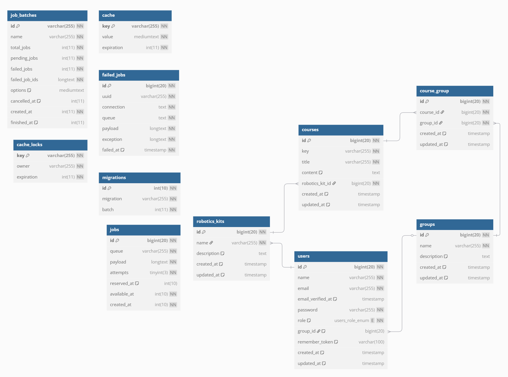

# Sistema de Escuela de Robótica

## Descripción del Proyecto

Este sistema fue desarrollado para una pequeña escuela de robótica con el fin de facilitar la impartición de clases. Permite a los usuarios (estudiantes, docentes y administrativos) acceder a la plataforma, consultar cursos y gestionar grupos.

Características principales:
- Gestión de usuarios con roles (estudiante, docente, administrativo)
- Administración de kits de robótica
- Creación y asignación de cursos
- Organización de estudiantes en grupos de diferentes niveles

## Diagrama ER

## Tecnologías Utilizadas

- Laravel 12
- MySQL
- PHP 8.2
- Eloquent ORM

## Instalación

1. Clonar el repositorio
2. Configurar archivo .env
3. Ejecutar `composer install`
4. Ejecutar `php artisan migrate --seed`
5. Ejecutar `php artisan serve`

## Datos de Prueba

El sistema incluye datos de prueba:
- 3 usuarios predefinidos (admin, profesor, estudiante)
- 3 kits de robótica
- 100 cursos generados automáticamente
- 3 grupos (principiante, intermedio, avanzado)
